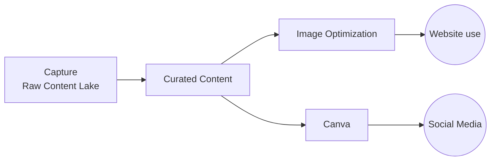

# Choosing a Digital Asset Management System

### **Purpose**

We need to choose a tool or workflow for storing and managing our digital assets—primarily **images, videos, brand materials**, and possibly other types of content. The goal is to **centralize access, support content reuse, and enable easy collaboration**.

### **Core Requirements**

* **Access**: It should be easy for people beyond the core team to access—**open access for viewing/downloading**, while **uploading/editing is controlled**.  
* **Collaboration**: Ideally allows for some **lightweight editing** or remixing of materials by users.  
* **Cost**: Needs to be **low-cost or free**, especially when adding new team members, since we are a **non-profit with many volunteers**.  
* **Usability**: Simple and intuitive to use—for both storing assets and retrieving them later.  
* **Support for Media**: Must support **images and video well**, including basic media previews and embedding.  
* **Content Creation**: Bonus if the platform makes it easy to **create new assets** from existing materials.

### **Current Context**

We are already using tools like **Canva** and potentially **Figma**, and have considered rolling our own storage solution (e.g., GitHub with LFS, Cloudflare R2 with a frontend). Each of these has trade-offs, especially around **video handling, upload UX, and ease of use** for non-technical users.

### **Next Step**

We are looking for a concise **comparison of 2–3 well-known tools** used for digital asset management and brand development, including a breakdown of:

* Cost (esp. for team use)  
* Ease of creating new content  
* General usability  
* Key features (esp. for image/video storage and access)

No recommendation yet—this is just to define the evaluation frame.

```
+-----------------------+        +------------------+
| Capture               | -----> | Curated Content  |
| Raw Content Lake      |        |                  |
+-----------------------+        +------------------+
                                           |
                                           v
                +---------------------+         +-------------+
                | Image Optimization  |         | Canva       |
                |                     |         |             |
                +---------------------+         +-------------+
                          |                           |
                          v                           v
                   ( Website use )              ( Social Media )
```


